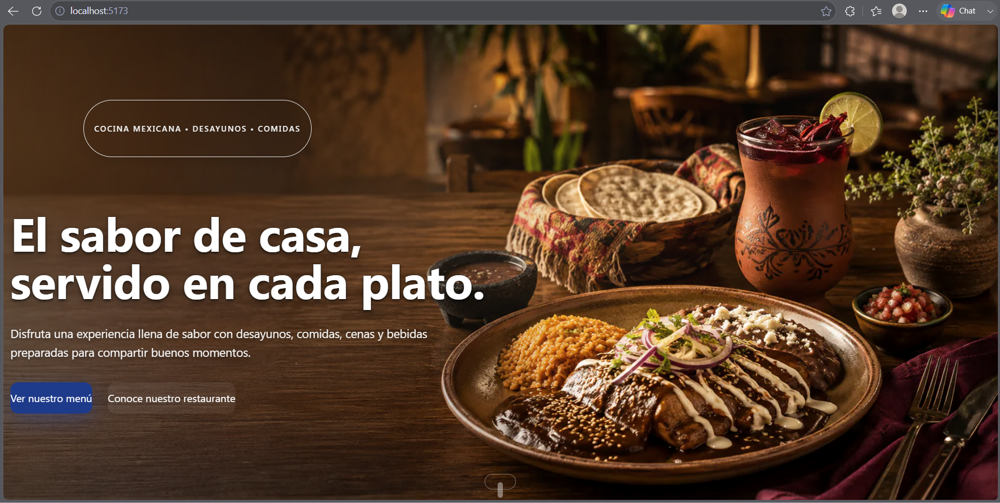
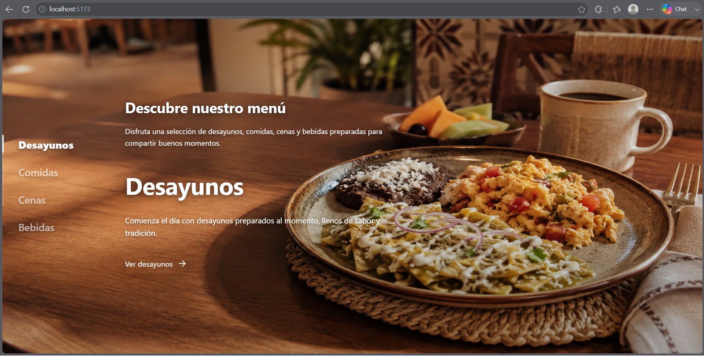
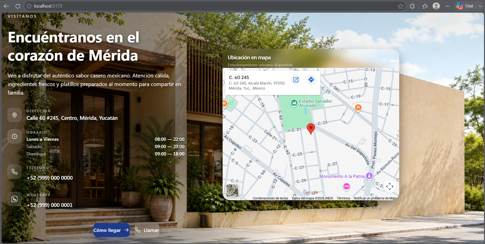
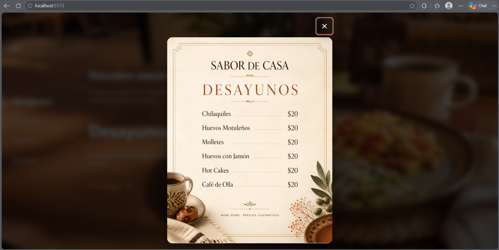
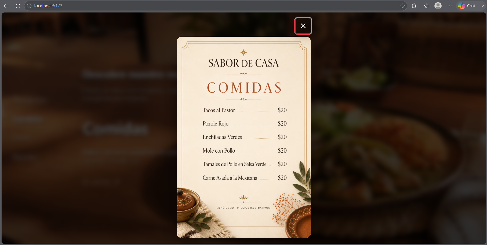
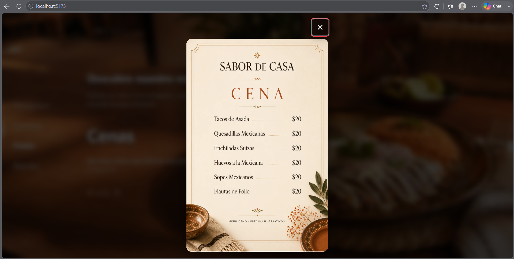
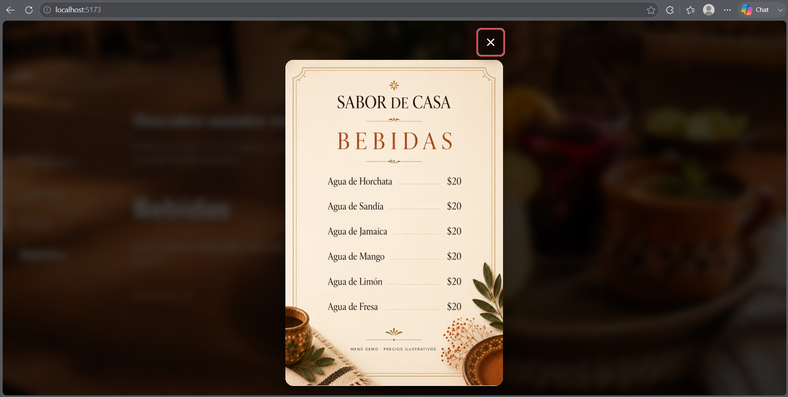
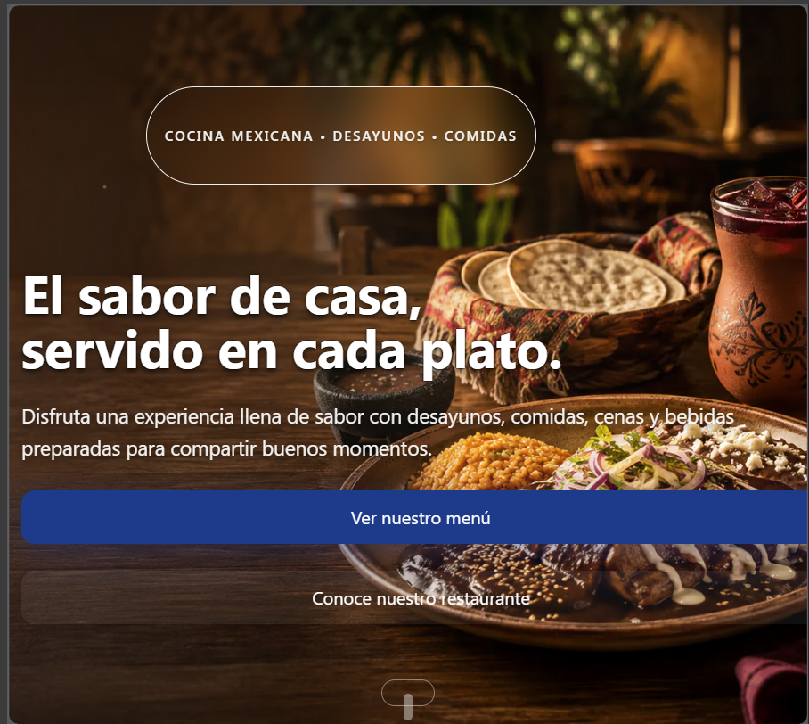
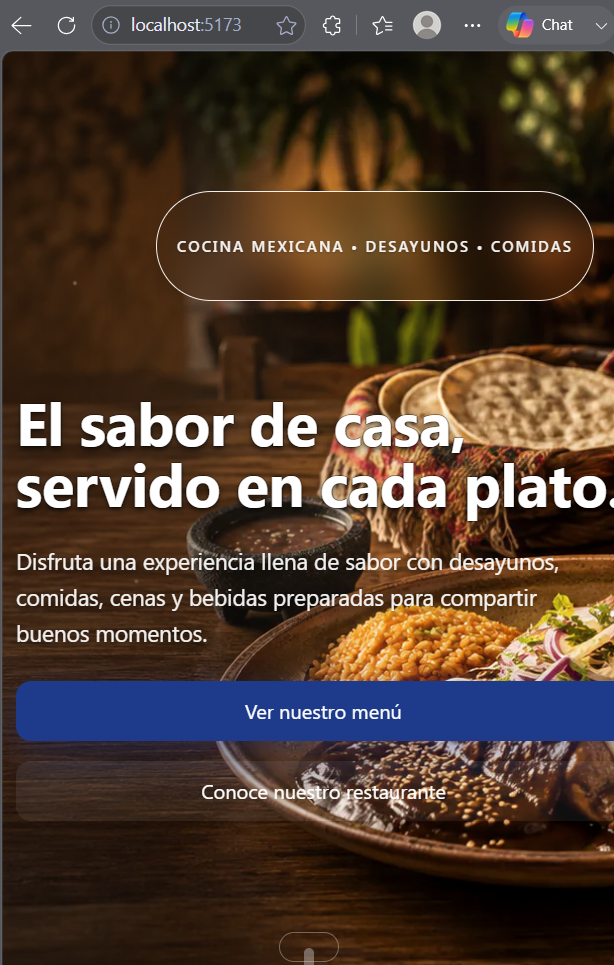

# 🍽️ Restaurant Web Demo

> Sitio web moderno, responsivo y cinematográfico diseñado como demostración comercial para restaurantes.

[
[
[
[
[
[

---

## 📖 Descripción

**Restaurant Web Demo** es una muestra comercial de sitio web diseñada para restaurantes. Presenta una experiencia visual cinematográfica con navegación por escenas, menú interactivo modal y una sección de ubicación con mapas y llamadas a la acción integradas.

> ⚠️ **Nota:** El restaurante mostrado (nombre, datos y ubicación) es ficticio. Este proyecto funciona exclusivamente como demostración de portafolio, y muestra técnica, lista para ser adaptada a un negocio real. No se presenta como un producto ya en producción.

El diseño prioriza la experiencia del usuario:

- Experiencia visual cinematográfica
- Rendimiento optimizado en desktop, tablet y móvil
- Navegación fluida por escenas
- Menú modal con animaciones suaves
- CTAs rápidos para contacto y ubicación

---

## 🌐 Demo

[Ver demo en vivo](URL_DEMO)

> Demo local / deployment pendiente.

---

## 📸 Vista previa



---

## ✨ Características

| Característica | Detalle |
|---|---|
| 🎬 Hero visual cinematográfico | Pantalla completa con overlay y entradas animadas |
| 🧭 Navegación por escenas | Experiencia guiada |
| 🍽️ Categorías interactivas | Desayunos, Comidas, Cenas, Bebidas |
| 🪟 Modal de Menú | Modal cinematográfico con blur y transiciones suaves |
| 🎞️ Transiciones cinematográficas | Escenas con View- blur y focus |
| 🌆 Backdrop blur | Efecto desenfoque de fondo en modales |
| 📍 Google Maps integrado | Iframe embebido |
| 📍 Sección de ubicación | Información del local, horario, teléfono, WhatsApp |
| 🚩 CTA «Cómo llegar» | Redirección Google Maps Directions |
| 📞 CTA «Llamar» | Link tel:+52 directo |
| 💬 WhatsApp | Inicio rápido de conversación |
| 📱 Diseño responsive | Desktop · Tablet · Mobile |

---

## 🎬 Escenas

El recorrido cinematográfico se divide en escenas:

### Scene 01 — Hero


Bienvenida visual del restaurante, llamado a la acción principal.

### Scene 02 — Categorías



Exploración rápida de categorías del menú.

### Scene 03 — Menú


Detalle de cada categoría con platos y precios.

### Scene 04 — Location



Ubicación, contacto, mapa y CTAs.

---

## 🍽️ Menú interactivo

| Categoría | Captura |
|---|---|
| 🥞 Desayunos |  |
| 🌮 Comidas |  |
| 🍲 Cenas |  |
| 🥤 Bebidas |  |

Apertura cinematográfica ≈ 750 ms con **cierre instantáneo**.

---

## 📱 Responsive Design

### Desktop


### Tablet


### Mobile


Diseño fluido y probado en 4 breakpoints: 1920×1080, 1366×768, 768×1024 y 390×844.

---

## 📍 Location Experience


- Información de contacto (teléfono, WhatsApp)
- Horarios de atención
- Mapa embebido de Google Maps
- CTA **«Cómo llegar»** (Google Maps Directions
- CTA **«Llamar»** (tel:)
- Botón directo de WhatsApp

---

## 🛠️ Tecnologías

| Área | Tecnología | Versión |
|---|---|---|
| Framework UI | **React** | 19.2 |
| Lenguaje | **TypeScript** | 6.0 |
| Build tool / Dev Server | **Vite** | 8.1 |
| Estilos | **Tailwind CSS** | 4.3 |
| Utilidades className | **clsx** + **tailwind-merge** | 2.1 / 3.6 |
| Iconografía | **lucide-react** | 1.28 |
| Optimización imágenes | **sharp** (Vite asset) | 0.35 |
| Compilación JSX | **Babel + React Compiler** | 7.29 / 1.0 |
| Linting | **ESLint** + typescript-eslint + react-hooks + react-refresh | 10.6 / 8.62 |
| Formateo | **Prettier** | 3.9 |

---

## 📂 Estructura del proyecto

```
restaurant-web-demo/
├── src/
│   ├── features/          # Features (hero, storytellingNavigation, location, footer)
│   ├── components/      # Componentes UI reutilizables (Button, Container, Heading, Text, …)
│   ├── shared/            # Capas compartidas (Editorial, layout)
│   ├── assets/          # Imágenes y recursos estáticos
│   ├── lib/             # Utilidades (cn, shared)
│   ├── App.tsx
│   └── main.tsx
├── public/
├── README.md
├── package.json
├── tsconfig.app.json
├── tsconfig.json
├── vite.config.ts
├── eslint.config.js
└── .prettierrc
```

---

## 🚀 Instalación

```bash
git clone https://github.com/tu-usuario/restaurant-web-demo.git
cd restaurant-web-demo
npm install
npm run dev
```

Abre [http://localhost:5173](http://localhost:5173) en tu navegador.

---

## 📦 Build

```bash
npm run build
```

El build de producción se genera en `dist/`.

Para preview local:

```bash
npm run preview
```

---

## ✅ Estado

- [x] Demo de portafolio / demostración comercial
- [x] Experiencia cinematográfica 3 escenas
- [x] Modal cinematográfico 4 categorías
- [x] Ubicación con mapas y CTAs
- [x] Responsive 4 breakpoints
- [x] 0 TypeScript errors
- [x] 0 ESLint errors
- [x] 0 Vulnerabilidades

Deployment público: **Pendiente**

---

## 👨‍💻 Autor

**Miguel Angel De La Cruz Centeno**

WhatsApp: **9131036289

México
